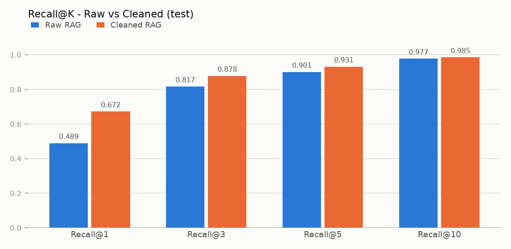
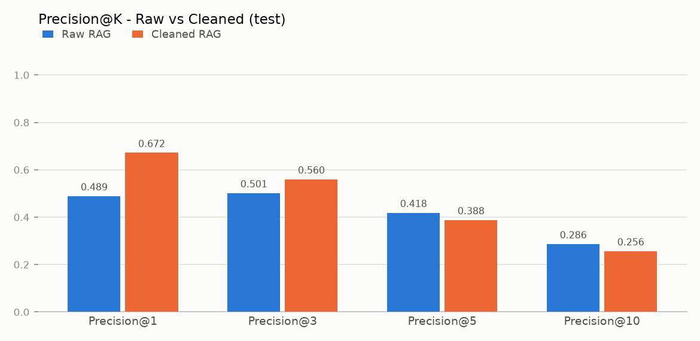
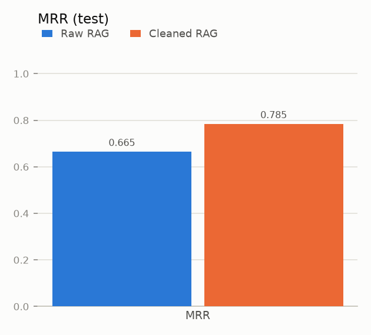
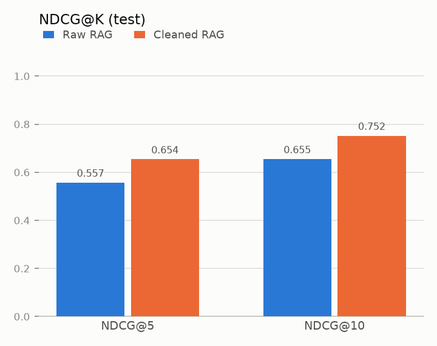

# Evaluation Report - Raw RAG vs Cleaned RAG (test split)

All numbers below were produced by running the pipeline; nothing is hand-entered.

## Verdict

**Cleaned RAG** performs better on the core retrieval metrics (4/4 of recall@1, recall@5, mrr, ndcg@10 improved).

- Recall@1: 0.4885 → 0.6718 (+0.1832 absolute, +37.5%)
- MRR: 0.6653 → 0.7845 (+0.1193 absolute, +17.9%)
- Improved: recall@1, recall@3, recall@5, recall@10, precision@1, precision@3, mrr, ndcg@5, ndcg@10, semantic_similarity_top1, semantic_similarity_best_top5
- Worse: precision@5, precision@10
- Unchanged: none

## Dataset statistics

| Item | Value |
|---|---:|
| Train size (raw corpus) | 539 |
| Validation size | 132 |
| Test size | 139 |
| Cleaned train size | 399 |
| Raw index chunks | 574 |
| Cleaned index chunks | 435 |
| test rows | 139 |
| &nbsp;&nbsp;excluded: empty question/answer | 1 |
| &nbsp;&nbsp;excluded: leaked from train (exact/normalized) | 6 |
| &nbsp;&nbsp;excluded: answer not in corpus | 1 |
| **Questions evaluated (identical for both)** | **131** |

Cleaning removed 46 invalid rows, 65 exact duplicates and 29 normalized duplicates (see `data_cleaning_report.md`).

## Retrieval metrics

| Metric | Raw RAG | Cleaned RAG | Abs. diff | Improvement |
|---|---:|---:|---:|---:|
| Recall@1 | 0.4885 | 0.6718 | +0.1832 | +37.5% |
| Recall@3 | 0.8168 | 0.8779 | +0.0611 | +7.5% |
| Recall@5 | 0.9008 | 0.9313 | +0.0305 | +3.4% |
| Recall@10 | 0.9771 | 0.9847 | +0.0076 | +0.8% |
| Precision@1 | 0.4885 | 0.6718 | +0.1832 | +37.5% |
| Precision@3 | 0.5013 | 0.5598 | +0.0585 | +11.7% |
| Precision@5 | 0.4183 | 0.3878 | -0.0305 | -7.3% |
| Precision@10 | 0.2863 | 0.2565 | -0.0298 | -10.4% |
| MRR | 0.6653 | 0.7845 | +0.1193 | +17.9% |
| NDCG@5 | 0.5573 | 0.6541 | +0.0968 | +17.4% |
| NDCG@10 | 0.6549 | 0.7521 | +0.0972 | +14.8% |
| Semantic Similarity (top-1) | 0.6570 | 0.8955 | +0.2385 | +36.3% |
| Semantic Similarity (best of top-5) | 0.9690 | 0.9833 | +0.0144 | +1.5% |

Improvement % = (Cleaned − Raw) / Raw × 100 (n/a when Raw = 0). Semantic Similarity is the cosine similarity between the expected answer and retrieved answer embeddings; it is **not** accuracy.

## Interpreting the metrics

- **Recall@K** = share of questions with a correct document anywhere in the top K (hit rate).
- **Precision@K** = share of the top K that is correct. Note: the raw corpus contains several *copies* of many answers (duplicates), and each copy counts as a separate relevant document. That lets raw fill more of the top K with correct copies, which can raise raw Precision@K at larger K without giving the user any extra information. Read Precision@K together with Recall@K and MRR.
- **MRR** rewards placing the first correct document high. **NDCG@K** rewards good ordering of all correct documents, normalized by the ideal ranking *for that corpus*.

In this run Precision@K got worse for: precision@5, precision@10. This is consistent with the duplicate effect above: after de-duplication there are fewer correct copies to fill the list.

## Figures

## Error analysis

Success = correct document within top 1.

| Category | Questions |
|---|---:|
| raw_fail_clean_success | 26 |
| raw_success_clean_fail | 2 |
| both_failed | 41 |
| both_succeeded | 62 |

Same breakdown at other K:

| K | raw_fail_clean_success | raw_success_clean_fail | both_failed | both_succeeded |
|---|---:|---:|---:|---:|
| 1 | 26 | 2 | 41 | 62 |
| 5 | 4 | 0 | 9 | 118 |

Of the 26 questions that only the cleaned pipeline answered, **24** had at least one raw document ranked above the correct answer that cleaning later removed (empty answer, junk, too short, duplicate).

**What was the raw pipeline's top-1 document?** (looked up in the cleaning log)

| Raw top-1 status | All questions |
|---|---:|
| kept | 88 |
| removed:empty_answer | 17 |
| removed:too_short_answer | 9 |
| kept_flagged | 7 |
| removed:null_answer | 7 |
| removed:null_question | 2 |
| removed:normalized_duplicate_qa_pair | 1 |

Rows marked `removed:*` are records the cleaner deleted (duplicates, empty answers, junk) that the raw retriever still ranked first - direct evidence of how noise affects the raw pipeline. A `removed:exact_duplicate_qa_pair` top-1 can still be a *correct* answer (it is a copy), so this table explains rankings, not failures by itself.

Full examples per category: `error_analysis.md`. Per-question data: `evaluation_results.csv`.

## Reproducibility

| Setting | Value (identical for both pipelines) |
|---|---|
| embedding_model | `sentence-transformers/all-MiniLM-L6-v2` |
| chunk_size | `1000` |
| chunk_overlap | `200` |
| top_k | `10` |
| chunk_fetch_multiplier | `3` |
| distance_metric | `cosine` |
| lowercase_documents | `False` |
| eval_k_values | `[1, 3, 5, 10]` |
| ndcg_k_values | `[5, 10]` |
| exclude_leaked_eval_questions | `True` |
| corpus version (raw / cleaned) | `482503f647648475` / `4f2cb31a69052d53` |
| eval file version | `3b5cdc616dcf8f7a` |

